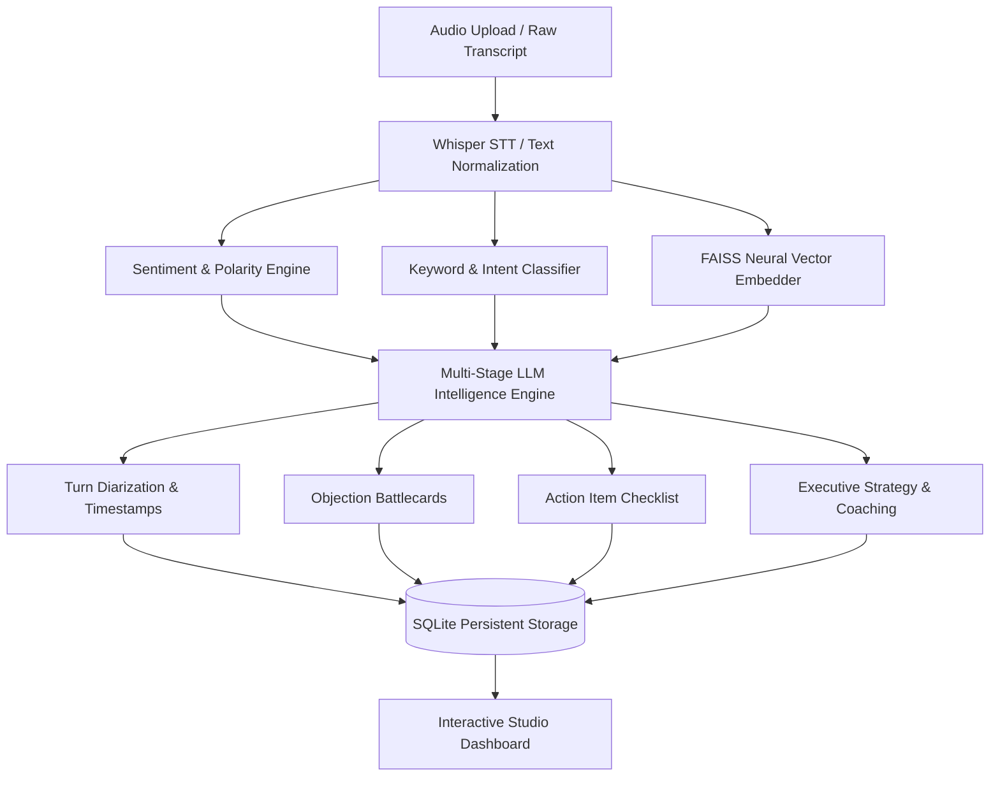

# 🎙️ CallIQ — Conversational Sales & Support Intelligence Platform

[](https://streamlit.io/)
[](https://www.python.org/)
[](https://groq.com/)
[](https://github.com/facebookresearch/faiss)
[](https://huggingface.co/)

> **CallIQ** is an enterprise conversational intelligence platform that transforms sales calls, customer support dialogues, and discovery meetings into structured, actionable coaching intelligence. Built with **Groq LLM cluster**, **Whisper-Large-V3**, **Sentence-Transformers**, **FAISS Neural RAG**, and **Streamlit**, CallIQ provides real-time speech diarization, objection detection, automated battlecard generation, and sales coaching metrics.

---

## 📑 Table of Contents
- [Executive Overview](#-executive-overview)
- [System Architecture & Processing Pipeline](#-system-architecture--processing-pipeline)
- [Key Features & Capabilities](#-key-features--capabilities)
- [Warm Canvas & Cobalt UI Design System](#-warm-canvas--cobalt-ui-design-system)
- [Project Directory Structure](#-project-directory-structure)
- [Prerequisites & Environment Configuration](#-prerequisites--environment-configuration)
- [Quickstart Guide](#-quickstart-guide)
- [Database Schema & Persistence](#-database-schema--persistence)
- [LLM Engine & Model Resilience](#-llm-engine--model-resilience)
- [License](#-license)

---

## 🏛 Executive Overview

CallIQ moves beyond basic transcription by extracting actionable revenue and customer retention signals:

1. **Ultra-Fast Speech Transcription**: Uses Groq Whisper-Large-V3 for low-latency audio transcription of `.mp3`, `.wav`, and `.m4a` files.
2. **Automated Turn Diarization**: Structures raw dialogue into sequential conversational turns with timestamps and speaker attribution (`Customer` vs `Sales Manager`).
3. **Objection Detection & Sales Battlecards**: Identifies customer friction points (Pricing, Timing, Competition, Authority) and generates tailored rebuttals.
4. **Action Item Checklist**: Automatically compiles post-call commitments and next steps categorized by assignee and priority.
5. **Conversational Coaching Metrics**: Computes Talk-to-Listen ratios, Call Quality Scores (0–100), and Deal Closing Probabilities.
6. **Neural RAG Context**: Queries a local FAISS vector index of past conversations to provide relevant organizational context to the AI analyst.

---

## 📐 System Architecture & Processing Pipeline



---

## ✨ Key Features & Capabilities

- **🎙️ Interactive Speech Studio**: Diarized speech bubbles with timestamps, highlighted buying signals, and custom audio waveform player.
- **🛡️ Customer Objection Battlecards**: Real-time identification of customer hesitations paired with field-tested sales responses.
- **📋 Automated Task & Commitment Tracker**: Interactive checkboxes for post-call follow-ups with priority ratings.
- **📊 Sales Coaching Scorecard**: Quantitative assessment of rep engagement, monologue prevention, and deal velocity.
- **📁 Searchable CRM Call Archive**: Historical database of recorded interactions with multi-parameter filtering.
- **📈 Macro Conversation Analytics**: Dynamic intent distribution donut charts and sentiment trendlines over time.
- **📚 Reference Library**: Built-in enterprise dialogue dataset for one-click testing and demonstration.

---

## 🎨 Warm Canvas & Cobalt UI Design System

Designed for high readability, modern executive aesthetic, and frictionless workflow:

- **Color Palette**: Warm Peach/Cream background (`#FDF6ED`, `#FFF9F2`), Cobalt Navy Primary (`#4667A7`, `#3B5B99`), Warm Honey Gold (`#F5BA72`), and Apricot Accent (`#E89A4B`).
- **Sidebar Profile & Navigation**: Senior Sales Director profile card with instant navigation across Studio, Archive, Analytics, and Library.
- **Top Metrics Row**:
  - `Call Quality Ring`: Overall score percentage with talk ratio and sentiment breakdown.
  - `Duration & Turn Tracker`: Minutes processed and latency metrics.
  - `Deal Health & Intent Badge`: Visual deal health classification (`🟢 Healthy Deal`, `🟡 Pricing Friction`, `🔴 Churn Risk`).

---

## 📂 Project Directory Structure

```text
AI CALL ANALYZER/
├── app.py                     # Main Streamlit intelligence studio & dashboard
├── requirements.txt           # Python dependency specifications
├── .env                       # Environment variables (Groq API Key)
├── modules/
│   ├── data_loader.py         # Hugging Face DialogSum loader & offline samples
│   ├── database.py            # SQLite schema, migrations & CRUD operations
│   ├── embeddings.py          # Sentence-Transformers vector embedding model
│   ├── insights.py            # Multi-stage conversational analysis orchestrator
│   ├── intent.py              # Hybrid LLM & rule-based customer intent detector
│   ├── keywords.py            # Natural language business keyword extractor
│   ├── llm_engine.py          # Groq multi-model fallback & prompt pipelines
│   ├── preprocessing.py       # Transcript normalization & cleanup utilities
│   ├── sentiment.py           # RoBERTa sentiment classifier with fallback
│   ├── stt.py                 # Groq Whisper-Large-V3 speech-to-text integration
│   └── vector_db.py           # FAISS index management & similarity search
├── data/
│   ├── call_analyzer.db       # SQLite persistent storage database
│   ├── faiss_index.bin        # Binary FAISS vector search index
│   └── faiss_index_metadata.pkl # Vector metadata mappings
└── README.md                  # System documentation
```

---

## 🔑 Prerequisites & Environment Configuration

### Prerequisites
- **Python** >= 3.9
- **Groq API Key** (Get free key at [console.groq.com](https://console.groq.com))

### Environment Configuration

Create a `.env` file in the project root:

```env
GROQ_API_KEY=gsk_your_groq_api_key_here
```

---

## 🚀 Quickstart Guide

### 1. Install Dependencies
```bash
pip install -r requirements.txt
```

### 2. Launch the Application
```bash
streamlit run app.py
```
*The application will open automatically at `http://localhost:8501`.*

---

## 💾 Database Schema & Persistence

CallIQ stores historical calls and telemetry in an embedded SQLite database (`data/call_analyzer.db`):

| Column | Type | Description |
|---|---|---|
| `id` | `INTEGER PRIMARY KEY` | Unique call identifier. |
| `timestamp` | `DATETIME` | Call recording or ingestion time. |
| `source_type` | `TEXT` | `Audio` or `Text`. |
| `filename` | `TEXT` | File name or identifier. |
| `transcript` | `TEXT` | Full dialogue text. |
| `sentiment_score` | `REAL` | Normalized sentiment score (0.0 – 1.0). |
| `sentiment_label` | `TEXT` | `Positive`, `Neutral`, or `Negative`. |
| `intent` | `TEXT` | Specific primary customer intent. |
| `risk_level` | `TEXT` | Deal health classification. |
| `keywords` | `JSON` | Extracted business keyword list. |
| `insights` | `TEXT` | Strategic AI recommendations. |
| `dialogue_turns` | `JSON` | Structured turn-by-turn diarization. |
| `action_items` | `JSON` | Action item checklist with assignees. |
| `objections` | `JSON` | Detected objections and battlecards. |
| `coaching_metrics` | `JSON` | Talk-to-listen ratios and quality scores. |
| `latency_metrics` | `JSON` | Sub-second latency telemetry. |

---

## 🧠 LLM Engine & Model Resilience

CallIQ features an automatic multi-model fallback chain across active Groq models:
- **Primary**: `openai/gpt-oss-120b`
- **Fallback 1**: `openai/gpt-oss-20b`
- **Fallback 2**: `qwen/qwen3.8-27b`
- **Fallback 3**: `qwen/qwen3.6-27b`
- **Fallback 4**: `groq/compound`

This ensures zero downtime from model deprecation or rate limits.

---

## 📄 License

This project is licensed under the **MIT License**.
